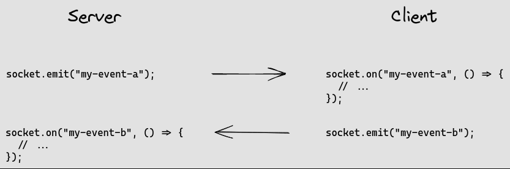

# TP sur les websockets

Nous allons manipuler les websokets avec React & Node.js.

Nous utilisons le pacquage [socket.io](https://socket.io/) qui fait très bien le travail !

## Mais comment ça marche ?



Avec l'image ci-dessus, j'espère que ça vous aide.

C'est une communication bidirectionnelle entre le client et le serveur. On appelle ça une communication full duplex.

## ⚙️ Backend

Coté backend nous allons faire un serveur `express` simple.

Mais nous allons quand même faire quelques modifications par rapport à ce qu'on a l'habitude de faire.

Nous allons utiliser un paquet natif de nodejs qui est `http` :

```js
const express = require("express");
// pourquoi http ici ? Car nous allons l'utiliser dans la création de notre server
// qui va permettre de réutiliser le serveur avec socket.io 
// avec la même instance de serveur HTTP !
const http = require("http");
const app = express();
// ici
const server = http.createServer(app);
```

### Ensuite ?

Ensuite nous allons nous intéresser à la partie `socket.io` :

```js
// Nous allons utiliser le paquet socket.io
// Je require la librairie socket.io et je l'assigne à une variable `io`, celui-ci prendra mon serveur HTTP
const io = require("socket.io")(server);

// io.on permet de lister les événements qui se passent sur le serveur
// Dans notre cas, nous allons lister l'événement `connection`
io.on("connection", (socket) => {
    // Je récupère l'id du socket que je définis en tant que mon user.
    console.log("New user : ", socket.id);

    // Socket.on, comme pour io, permet de lister les événements qui se passent sur le client
    socket.on("sendMessage", (data) => {
        // io.emit permet d'envoyer un message à tous les clients connectés, en passant comme argument `data`
        io.emit("newMessage", data);
    });

    // Permet de déconnecter un client
    socket.on("disconnect", () => {
        console.log("user disconnected: ", socket.id);
    });
});

```

<details>
    <summary>Code</summary>

```js
const express = require("express");
const http = require("http");
// par anticipation, on installe les cors.
const cors = require("cors");

const app = express();
const server = http.createServer(app);

app.use(cors());

const io = require("socket.io")(server);
const port = 5050;

io.on("connection", (socket) => {
  console.log("New user : ", socket.id);

  socket.on("sendMessage", (data) => {
    io.emit("newMessage", data);
  });

  // disconnect
  socket.on("disconnect", () => {
    console.log("user disconnected: ", socket.id);
  });
});

server.listen(port, (err) => {
  if (err) {
    console.log(err);
  }
  console.log(`server is listening on port ${port}`);
});
```
</details>

## 🖥 Frontend

Nous devons depuis le frontend utiliser un pacquage concernant `socket.io-client`.

```shell
npm install socket.io-client
```

Ensuite, on va l'utiliser dans notre code :

```js
// App.js

// Nous allons utiliser le paquet socket.io-client du coté de React
import { io } from "socket.io-client";
```

On va créer un socket qui va se connecter au serveur.

```js
const ENDPOINT = "URL_BACKEND";
 // OnMount
  useEffect(() => {
    const socket = io(ENDPOINT);
    
    setSocket(socket);

    // https://socket.io/docs/v4/client-socket-instance/#connect
      // Cet événement est déclenché par l'instance Socket lors de la connexion et de la reconnexion.
      socket.on("connect", () => {
      setCurrentUser(socket.id);
    });

    return () => {
      socket.emit("disconnectUser", socket.id);
      socket.off();
    };
  }, []);
```

Mais pour mettre à jour ?

Nous allons devoir utiliser `useEffect` pour mettre à jour notre state.

```js
  // OnUpdate
  useEffect(() => {
    if (socket) {
      socket.on("newMessage", (message) => {
        setMessageList([...messageList, message]);
      });
    }
  }, [messageList, socket]);

```

Et pour envoyer un message ?

```js
// OnSubmit
const handleSubmit = (e) => {
    e.preventDefault();
    socket.emit("sendMessage", {
        author: nickName,
        text: newMessageText,
        id: currentUser,
    });
    setNewMessageText("");
};
```

<details>
    <summary>Code</summary>

```js
import React, { useEffect, useRef } from "react";
import { io } from "socket.io-client";
import "./App.css";

const App = () => {
  const [messageList, setMessageList] = React.useState([]);
  const [newMessageText, setNewMessageText] = React.useState("");
  const [nickName, setNickName] = React.useState("");
  const [socket, setSocket] = React.useState(null);
  const [currentUser, setCurrentUser] = React.useState(null);

  const ENDPOINT = "http://localhost:5050";

  // OnMount
  useEffect(() => {
    const socket = io(ENDPOINT);

    setSocket(socket);

    socket.on("connect", () => {
      setCurrentUser(socket.id);
    });

    return () => {
      socket.emit("disconnectUser", socket.id);
      socket.off();
    };
  }, []);

  // OnUpdate
  useEffect(() => {
    if (socket) {
      socket.on("newMessage", (message) => {
        setMessageList([...messageList, message]);
      });
    }
  }, [messageList, socket]);

  const handleSubmit = (e) => {
    e.preventDefault();
    socket.emit("sendMessage", {
      author: nickName,
      text: newMessageText,
      id: currentUser,
    });
    setNewMessageText("");
  };

  return (
    <div className="App">
      <h2>Messages</h2>

      <div className="container">
        {messageList.map((message, id) => {
          return (
            <p
              key={id}
              className={message.id === currentUser ? "my-message" : "message"}
            >
              <strong>{message.author}</strong>: {message.text}
            </p>
          );
        })}
      </div>
      <form onSubmit={handleSubmit}>
        <h2>New Message</h2>
        <input
          type="text"
          name="author"
          placeholder="Ton pseudo"
          value={nickName}
          required
          onChange={(e) => setNickName(e.target.value)}
        />
        <input
          type="text"
          name="messageContent"
          placeholder="Ton message"
          value={newMessageText}
          required
          onChange={(e) => setNewMessageText(e.target.value)}
        />
        <input type="submit" value="Envoyer" />
      </form>
    </div>
  );
};

export default App;
```

</details>


# Et voilà !
